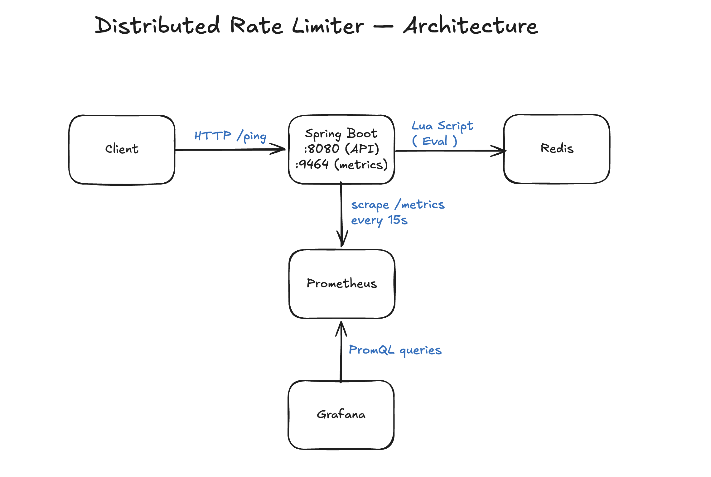

# Distributed Rate Limiter

A small Spring Boot service that limits how many requests a given user (identified by an
`X-User-Id` header) can send in a given time window. State is kept in Redis so multiple app
instances would share the same view of "how many requests has this user made recently?" —
which is the part that makes it *distributed*. Two algorithms are implemented: **fixed window**
and **sliding window** (Lua-scripted, atomic). The whole thing is wired up with OpenTelemetry
→ Prometheus → Grafana so you can actually *see* it work.

I built this as a learning project. The interesting parts ended up not being the algorithms —
those are in any blog post — but the **observability harness**, the **benchmark methodology**,
and the **discipline of measuring rather than guessing**. Full benchmark numbers and
algorithm comparison live in [`benchmarks/RESULTS.md`](benchmarks/RESULTS.md).

---

## Architecture



Two paths happen in parallel:

- **Request path** (top row): a client hits `/ping` on port `8080`. The
  `RateLimiterInterceptor` reads `X-User-Id`, asks the active strategy whether to allow the
  request, and returns either `200 OK` (with the response body) or `429 Too Many Requests`
  (with `Retry-After`, `X-RateLimit-Limit`, and `X-RateLimit-Remaining` headers). The
  sliding-window strategy talks to Redis via a single `EVAL` call — one round trip, atomic,
  no read-modify-write race possible.
- **Observability path** (lower half): the Spring Boot process exposes a *second* HTTP
  server on port `9464` that serves OpenTelemetry-format metrics. Prometheus (running in
  Docker) scrapes that endpoint every 15 seconds. Grafana (also in Docker) queries
  Prometheus via PromQL when you open the dashboard.

The two ports separate concerns: `8080` is the public API, `9464` is purely for metrics
scraping. They never share traffic.

---

## How a request flows through the code

To make the layering clear, here's what happens for a single `/ping` request when
`rate-limit.strategy=redis-sliding-window` is active:

1. **`PingController`** receives `GET /ping`. Every endpoint goes through the
   interceptor — `WebConfig.addInterceptors()` registers it without any path filters.
2. **`RateLimiterInterceptor.preHandle()`** runs first:
   - Reads `X-User-Id` from the request — returns `400 Bad Request` if missing.
   - Calls `RateLimiterService.validateRequest(userId)`.
3. **`RateLimiterService`** delegates to the active `RateLimitingStrategy` (chosen at
   startup via `@ConditionalOnProperty`).
4. **`RedisSlidingWindowStrategy.validate()`** delegates further to
   `RedisSlidingWindowRateLimitStore.checkAndAdd()`.
5. **`RedisSlidingWindowRateLimitStore.checkAndAdd()`**:
   - Builds a unique sorted-set member (`<timestamp>:<UUID>`).
   - Calls `redisTemplate.execute(slidingWindowScript, ...)` — a single Lua `EVAL`.
   - Records the call duration (`System.nanoTime()` based) into the
     `ratelimiter.redis.latency` histogram via `MetricsService.recordRedisLatency()`.
   - Returns a `CheckResult` (allowed/denied + counts).
6. **Back in the interceptor**: if rejected, sets `429`, headers (`Retry-After`,
   `X-RateLimit-Limit`, `X-RateLimit-Remaining`), body, and calls
   `metricsService.recordRejectedRequest(strategy)`. If allowed, calls
   `metricsService.recordAllowedRequest(strategy)` and returns `true` so the controller
   runs. (Note: the request *counter* is recorded here in the interceptor; the Redis
   *latency histogram* was already recorded inside the store at step 5.)
7. **OpenTelemetry SDK** stores both the counter increment and the histogram observation
   in process memory; Prometheus's next 15-second scrape will pick them up.

Three classes are doing all the interesting work: the **interceptor**, the **store**, and
the **metrics service**. Strategies are thin glue.

---

## What's in this repo

```
DistributeRateLimiter/
├── distributed-rate-limiter/      # Spring Boot app (Maven)
│   └── src/main/java/com/aditya/distributedratelimiter/
│       ├── interceptor/           # RateLimiterInterceptor — entry point
│       ├── strategy/              # FixedWindowStrategy (in-memory),
│       │                          # RedisFixedWindowStrategy,
│       │                          # RedisSlidingWindowStrategy
│       ├── store/                 # RateLimitStore, InMemoryRateLimitStore,
│       │                          # RedisRateLimitStore (fixed),
│       │                          # RedisSlidingWindowRateLimitStore (Lua script)
│       ├── service/               # RateLimiterService (delegates to strategy),
│       │                          # MetricsService (custom OTel counters & histogram)
│       ├── config/                # OpenTelemetryConfig (SDK setup, Prometheus exporter),
│       │                          # RateLimitProperties, RedisConfig, ClockConfig, WebConfig
│       ├── semantics/             # MetricsSemantics — typed metric / attribute names
│       ├── model/                 # RateLimitResult, UserRequestData
│       ├── constants/             # HeaderConstants
│       └── controller/            # PingController (the rate-limited /ping),
│                                   # RedisTestController (small /redis sanity-check endpoint)
│
├── monitoring/                    # Observability stack as code
│   ├── docker-compose.yml         # prometheus + grafana
│   ├── prometheus.yml             # scrape configs (port 9464 + Spring Actuator)
│   └── grafana/
│       ├── provisioning/          # auto-creates Prometheus datasource + dashboard provider
│       │   ├── datasources/prometheus.yml
│       │   └── dashboards/dashboards.yml
│       └── dashboards/
│           └── rate-limiter-overview.json   # 7-panel headline dashboard
│
├── benchmarks/
│   ├── rotate-users.lua           # wrk script: rotates X-User-Id across N users
│   └── RESULTS.md                 # full methodology, numbers, algorithm comparison
│
└── docs/
    └── screenshots/               # all images referenced from this README
```

---

## Running it locally

### Prerequisites
- **Java 21**
- **Maven** (or use the included `mvnw`)
- **Docker** (for Prometheus + Grafana)
- **Redis 6+** (`brew install redis`)

### Steps

```bash
# 1) Start Redis (in a separate terminal, or via brew services)
redis-server

# 2) Start Prometheus + Grafana
cd monitoring
docker compose up -d

# 3) Build and run the Spring Boot app (from repo root)
cd distributed-rate-limiter
./mvnw spring-boot:run

# 4) Smoke test
curl -i -H "X-User-Id: alice" http://localhost:8080/ping
# → 200 OK, body "pong"

# 5) Try to exceed the limit
for i in $(seq 1 10); do
  curl -s -o /dev/null -w "%{http_code}\n" -H "X-User-Id: alice" http://localhost:8080/ping
done
# → first N return 200, the rest return 429

# 6) Open the UIs
open http://localhost:3000           # Grafana (admin / admin)
open http://localhost:9090           # Prometheus
open http://localhost:9464/metrics   # raw OTel metrics from the app
```

Grafana is **auto-provisioned**: the Prometheus datasource and the **Rate Limiter
Overview** dashboard appear without any clicking. That's the point of
`monitoring/grafana/provisioning/` — the entire monitoring setup is reproducible from
`docker compose up`.

---

## Configuration

All knobs are in `distributed-rate-limiter/src/main/resources/application.properties`:

```properties
rate-limit.max-requests=100           # how many requests are allowed per window
rate-limit.window-size=10s            # window size (Spring Duration: 1s, 500ms, 1m, ...)
rate-limit.strategy=redis-sliding-window
# valid values:
#   fixed-window           — in-memory, single-process (synchronized)
#   redis-fixed-window     — Redis-backed INCR + EXPIRE
#   redis-sliding-window   — Redis-backed Lua script over a sorted set
```

The strategy beans are defined with Spring's `@ConditionalOnProperty`, so exactly one is
loaded at startup based on this property. Switching strategy = edit one line + restart.

OpenTelemetry export is configurable too:

```properties
otel.prometheus.port=9464              # port for the /metrics endpoint
otel.prometheus.host=0.0.0.0           # bind address
otel.prometheus.enabled=true           # turn off in tests
```

---

## Observability — what's instrumented

### Custom application metrics (from `MetricsService`)

| Metric | Type | Labels | What it measures |
|---|---|---|---|
| `ratelimiter.requests.total` | Counter   | `status` (allowed / rejected), `strategy` | Every request decision |
| `ratelimiter.redis.latency`  | Histogram | —                                        | Wall-clock latency of each Redis call (`System.nanoTime()`-based) |

The metric names live as enum values in `MetricsSemantics.java` so they're never spelled
inconsistently. The label-bearing `Attributes` objects are cached in a
`ConcurrentHashMap<String, Attributes>` keyed by `status|strategy` so the hot path
allocates no `Attributes` per request (`MetricsService.totalRequestAttributes`).

### Framework metrics (Spring Actuator + Micrometer)

Exposed at `/actuator/prometheus` on port `8080` and scraped by Prometheus alongside the
custom metrics. This gives you JVM, HTTP server, and Lettuce/Redis client metrics for free.

---

## The dashboard


Seven panels, all driven by PromQL queries stored in
`monitoring/grafana/dashboards/rate-limiter-overview.json`:

| Panel | What it shows | PromQL technique |
|---|---|---|
| **Allowed (selected range)** | Total `200`s in the time range | `sum(increase(...[$__range]))` |
| **Rejected (selected range)** | Total `429`s in the time range | `sum(increase(...[$__range]))` |
| **Rejection Ratio (5m)** | Gauge with thresholds (1% / 10%) | Ratio of two `rate()` queries with `clamp_min` to avoid divide-by-zero |
| **Request Rate by Status (req/s)** | Stacked time-series (allowed / rejected) | `sum by (status) (rate(...[1m]))` |
| **Request Rate by Strategy (req/s)** | Time-series grouped by strategy label | `sum by (strategy) (rate(...[1m]))` |
| **Top Rejecting Strategies (5m)** | Bar chart, top-K by rejection rate | `topk(5, sum by (strategy) (rate(...{status="rejected"}[5m])))` |
| **Redis Latency p50 / p95 / p99 (ms)** | Three lines from the histogram | `histogram_quantile(p, sum by (le) (rate(..._bucket[5m])))` |

All stat panels use Grafana's built-in `$__range` variable so they automatically reflect
the dashboard's time-range picker. There's also a `Strategy` template variable at the top
of the dashboard for filtering when both algorithms have run.

---

## Benchmark summary

Full methodology, configs, commands, and algorithm comparison are in
[`benchmarks/RESULTS.md`](benchmarks/RESULTS.md). Headline numbers from a MacBook Pro M1
Pro / 32 GB / Java 21 / Redis 8.6, single-instance, local Redis:

- **~21K req/s** sustained at **p99 9 ms** (sliding window, no rejection pressure)
- **0% deviation** from the configured limit under adversarial single-key load (300 of 300
  expected requests allowed across a 54K-request burst)
- **Saturation knee** at concurrency ≈ 200 (where p99 doubles and throughput plateaus)
- Fixed and sliding window benchmarked head-to-head — see `RESULTS.md` for the trade-off
  analysis and where the cost difference comes from

Load testing was done with **`wrk`** plus a Lua script (`benchmarks/rotate-users.lua`) that
rotates `X-User-Id` across N distinct users per request — needed because `wrk` and `hey`
otherwise send the same headers for every request, which doesn't reflect real multi-tenant
traffic.

---

## What I'd do next (deliberate non-goals for now)

- **Multi-instance test.** Run two Spring Boot instances behind a load balancer, hammer
  both, confirm the Redis-shared state limits each *user* across instances correctly. The
  whole point of "distributed" is unproven on a single box.
- **Distributed tracing.** Wire OTel traces (not just metrics) through the request path →
  Tempo or Jaeger. Lets you correlate a slow user request with the specific Redis call
  that caused it.
- **Token bucket strategy.** Industry standard at companies like Stripe; adds bursting
  semantics the current strategies don't support.

---

## Tech stack

- **Java 21** (LTS), **Spring Boot 3.5.14**, Maven
- **Redis 8.6** (state) — `StringRedisTemplate`, Lua scripts via `RedisScript<List>`
- **OpenTelemetry SDK 1.54** — direct SDK use (not the Java agent), Prometheus exporter
- **Spring Boot Actuator + Micrometer** — for framework-level metrics
- **Prometheus** + **Grafana** (Docker Compose, provisioned-as-code)
- **Load testing**: `wrk` + Lua scripting; `hey` for simpler one-shot runs
- **Tests**: JUnit 5, Spring Boot Test (unit and integration). A `@RepeatedTest(100)`
  concurrency test fires 20 threads against the same user key through the
  `redis-sliding-window` strategy and asserts that exactly the configured limit (5) is
  ever allowed — verifying the Lua script's atomicity end-to-end (requires a running
  Redis)

---

## Key files for reviewers

If you have ten minutes and want to read the *interesting* parts of the code:

1. **`interceptor/RateLimiterInterceptor.java`** — the entry point; reads the header,
   calls the strategy, increments the request counter (allowed/rejected) on
   `MetricsService`.
2. **`strategy/RedisSlidingWindowStrategy.java`** + **`store/RedisSlidingWindowRateLimitStore.java`** —
   the atomic Lua-script path. The script itself is a Spring `RedisScript` bean.
3. **`service/MetricsService.java`** + **`semantics/MetricsSemantics.java`** — typed metric
   names, attribute keys, and the per-request `Attributes` cache.
4. **`config/OpenTelemetryConfig.java`** — SDK setup: builds the `SdkMeterProvider`,
   registers the Prometheus HTTP server exporter on port 9464, exposes the
   `OpenTelemetry` bean that `MetricsService` consumes.
5. **`monitoring/grafana/dashboards/rate-limiter-overview.json`** — the dashboard. Every
   PromQL query lives here.
6. **`benchmarks/RESULTS.md`** — the experiments, in the order they were run, with the
   numbers that produced the headline metrics in this README.
